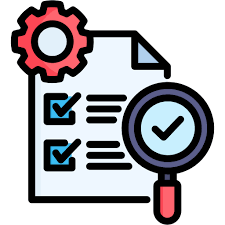

<h1 align="center">
  <br>
  
  <br>
  Finance Tracker
  <br>
</h1>

<h4 align="center">A modern, full-stack personal finance manager built with React & Spring Boot.</h4>

<p align="center">
  <a href="#key-features">Key Features</a> •
  <a href="#motivation">Motivation</a> •
  <a href="#tech-stack">Tech Stack</a> •
  <a href="#getting-started">Getting Started</a> •
  <a href="#why-this-project-stands-out">Why This Project Stands Out</a> •
  <a href="#upcoming-testing">Testing</a> •
  <a href="#contributing">Contributing</a> •
  <a href="#license">License</a>
</p>

<p align="center">
  
</p>

---

## Motivation

I found out that many of my friends were still using notepad to track their daily expenses. Realizing how inefficient and error-prone this was, I decided to build a modern, user-friendly finance tracker to help everyone manage their finances more effectively. This project was also developed as part of my placement preparation, so I focused on robust features and best practices suitable for real-world applications.

---

## Key Features
- **User Registration & Authentication**: Secure sign-up and login with user-specific data isolation.
- **Modern UI**: Responsive, professional interface using Material-UI (MUI).
- **Expense Management**: Add, edit, delete, and view expenses with category and date tracking.
- **Budget Management**: Set monthly budgets per category and get a clear overview of your spending.
- **Category Management**: Create and manage custom categories for personalized tracking.
- **Dashboard & Summaries**: Visual summaries and statistics to help you understand your spending habits.
- **Error Handling**: Robust error handling and user feedback throughout the app.
- **Data Security**: All user data is securely stored and isolated.
- **Dockerized Deployment**: Easily run the entire stack (frontend, backend, database) with Docker Compose.

---

## Tech Stack
- **Frontend**: React.js, Material-UI (MUI), Axios
- **Backend**: Java, Spring Boot, Spring Security, JPA/Hibernate
- **Database**: MySQL
- **Containerization**: Docker, Docker Compose

---

## Getting Started

### Prerequisites
- [Docker Desktop](https://www.docker.com/products/docker-desktop)
- [Git](https://git-scm.com/) (optional, for cloning the repo)

### Quick Start

```bash
# Clone the repository
git clone <repo-url>
cd Finance-Tracker-master

# Start the application
docker-compose up --build
```

- Frontend: [http://localhost:3000](http://localhost:3000)
- Backend API: [http://localhost:8080](http://localhost:8080)

To stop the application:
```bash
docker-compose down
```

---

## Why This Project Stands Out
- **Full-Stack Implementation**: Demonstrates proficiency in both frontend and backend development.
- **Modern UI/UX**: Uses industry-standard libraries for a professional look and feel.
- **RESTful API Design**: Clean, maintainable, and scalable backend architecture.
- **Robust Error Handling**: Defensive programming and clear user feedback.
- **Data Isolation**: Each user’s data is completely separated for privacy and security.
- **Dockerized**: Ready for deployment and easy to run anywhere.

---

## Upcoming: Testing
> **Note:**  
> Automated unit and integration tests are coming soon!  
> - **Unit Tests** for backend services and controllers (JUnit, Mockito)
> - **Integration Tests** for API endpoints
> - **Frontend Tests** using React Testing Library and Jest

---

## Contributing
Contributions are welcome! Please open issues or submit pull requests for improvements or bug fixes.

---

## License
This project is for educational and placement purposes. Feel free to use and modify it for your own learning.

---

<p align="center">
  <b>Made with ❤️ by Zubair Khan</b>
</p> 
